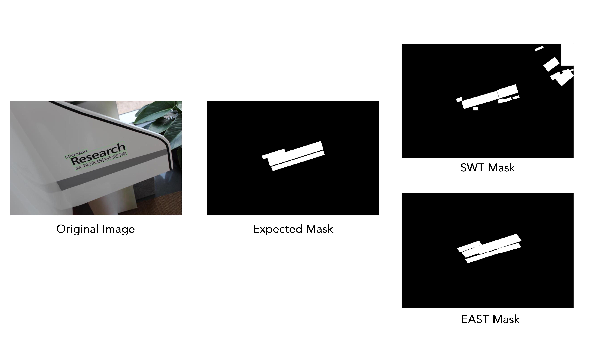

# Outdoor_Scenes_Text_Detection

Text Detection, Natural Image, Arbitrary Orientation, MSRA Text Detection 500 Database

This repository presents two ways to deal with text detection : SWT and EAST.

### SWT-based Detection

Exectuting code:
<code>python swt/text_detect.py --image IMG_0839_mask.png.JPG</code>

### EAST Method

Exectuting code:
<code>python east/main.py --input IMG_0839.JPG --model east/frozen_east_text_detection.pb</code>

### EAST & SWT Comparison
To compare the two approaches, it is possible to execute the <code>main.py</code> :
<code>python main.py</code>
